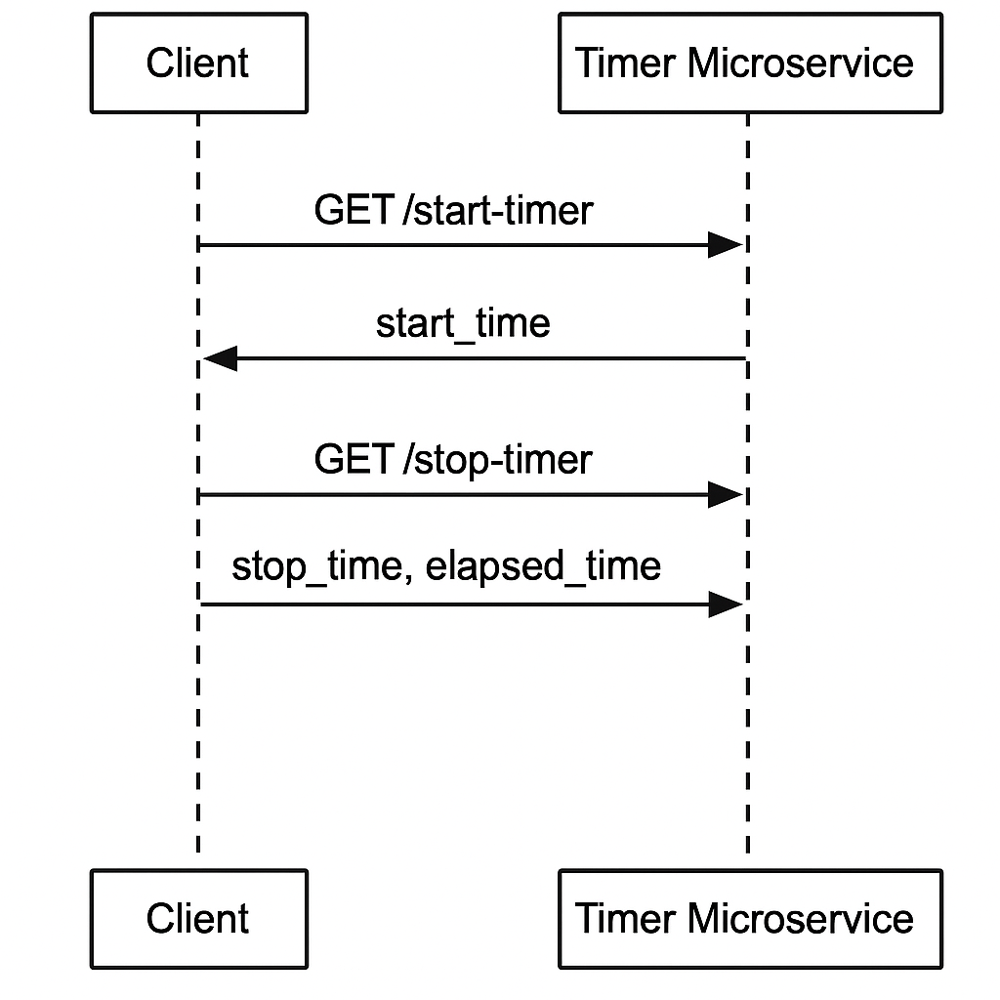

# ⏱️ Timer Microservice (Microservice A)

This microservice provides start/stop timer functionality with timezone support. It is implemented using **Python Flask** and returns ISO 8601 or UNIX timestamp results.

---

## 📡 Communication Contract

### 🔹 Requesting Data (Start Timer)

**Endpoint:** `GET /start-timer`  
**Parameters:**
- `timezone` (optional): Valid timezone string, e.g., `America/Los_Angeles`. Default is `UTC`.
- `format` (optional): `timestamp` or `iso8601`. Default is `iso8601`.

**Example Call:**
```python
import requests

response = requests.get("http://127.0.0.1:5000/start-timer", params={
    "timezone": "America/New_York",
    "format": "iso8601"
})
print(response.json())
# → {"start_time": "2025-08-04T19:30:00.123456-04:00"}
```

---

### 🔹 Receiving Data (Stop Timer)

**Endpoint:** `GET /stop-timer`  
**Parameters:**
- `timezone` (optional): Valid timezone string, e.g., `America/New_York`.
- `format` (optional): `timestamp` or `iso8601`.

**Example Call:**
```python
import requests

response = requests.get("http://127.0.0.1:5000/stop-timer", params={
    "timezone": "America/New_York",
    "format": "iso8601"
})
print(response.json())
# → {"stop_time": "2025-08-04T19:31:12.987654-04:00", "elapsed_seconds": 72.86}
```

---

## 🧭 UML Sequence Diagram


---

## ✅ Mitigation Plan

- **Teammate this was built for:** [INSERT NAME]
- **Current status:** ✅ Done and tested.
- **Access Instructions:**
  - Clone the repo: [https://github.com/YOUR_USERNAME/YOUR_REPO_NAME](https://github.com/YOUR_USERNAME/YOUR_REPO_NAME)
  - Install dependencies:
    ```bash
    pip install -r requirements.txt
    ```
  - Run the microservice:
    ```bash
    python app.py
    ```
  - Your client code must send HTTP requests to `http://127.0.0.1:5000`.

- **What to do if microservice is inaccessible:**  
  Contact me directly via Slack or email.  
  I am available daily from **10 AM – 10 PM (PST)**.

- **Deadline for reporting issues:**  
  **August 8th, 2025 at 11:59 PM PST**

- **Notes & Assumptions:**  
  - No test program is required to call my microservice. Use HTTP GET requests as shown above.
  - Python 3.8+ is recommended.

---

## 📂 Repo Structure
```
/your-repo
├── app.py
├── test_client.py
├── README.md
└── docs/
    └── UMLDiagram.png
```
response = requests.get("http://127.0.0.1:5000/stop-timer", params={
    "timezone": "America/New_York",
    "format": "iso8601"
})

print(response.json())
# → {"stop_time": "2025-08-04T19:31:12.987654-04:00", "elapsed_seconds": 72.86}




