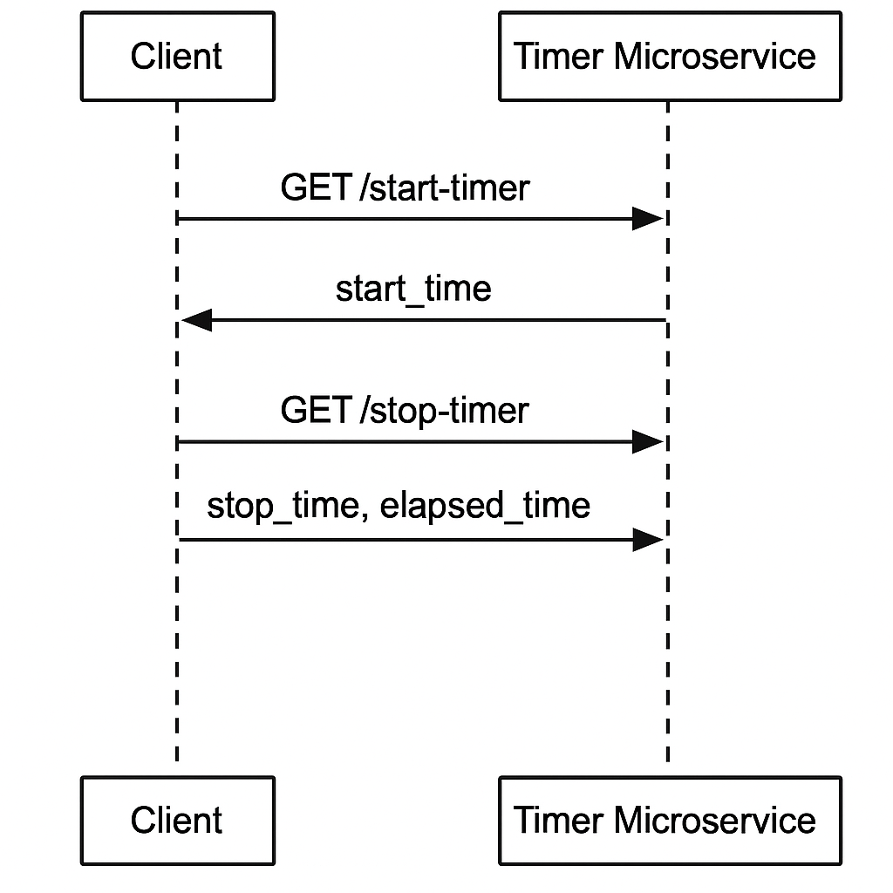

# ⏱️ UTC Timer (Microservice A)

This microservice provides programmatic start/stop timer functionality with timezone support. It is implemented using **Python Flask** and returns ISO 8601 or UNIX timestamp-formatted results.

---

## 📡 Communication Contract

### 🔹 Requesting Data (How to Start the Timer)

**Endpoint:** `GET /start-timer`  
**Parameters:**
- `timezone` (optional): Specify a valid timezone, e.g. `America/Los_Angeles`. Default is `UTC`.
- `format` (optional): Use `timestamp` or `iso8601`. Default is `iso8601`.

**Example Call (in Python):** To Request Data

```python
import requests

response = requests.get("http://127.0.0.1:5000/start-timer", params={
    "timezone": "America/New_York",
    "format": "iso8601"
})

print(response.json())
# → {"start_time": "2025-08-04T19:30:00.123456-04:00"}

Example Call How to Receive Data

import requests

response = requests.get("http://127.0.0.1:5000/stop-timer", params={
    "timezone": "America/New_York",
    "format": "iso8601"
})

print(response.json())
# → {"stop_time": "2025-08-04T19:31:12.987654-04:00", "elapsed_seconds": 72.86}




